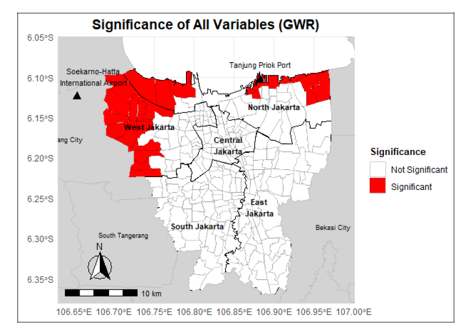

# Spatial Analysis for COVID-19 Mitigation Strategies  
## Case Study: Jakarta, Indonesia

  
  

---

## Overview

This project investigates the spatial distribution of COVID-19 cases in Mainland Jakarta to support early mitigation strategy development.

Using spatial statistical modelling, the study identifies geographic clustering patterns and examines how socioeconomic and demographic factors influence case intensity across districts.

The objective is to provide spatially grounded insights that can inform targeted public health interventions.

---

## Research Questions

- Are COVID-19 cases spatially clustered in Jakarta?
- Which socioeconomic variables are associated with higher infection rates?
- Do relationships between predictors and case counts vary geographically?

---

## Methodology

### Data
- COVID-19 case counts at district level (Jakarta)
- Socioeconomic and demographic indicators
- Administrative boundary shapefiles

### Spatial Analysis Pipeline

1. Exploratory spatial data analysis (ESDA)
2. Global spatial autocorrelation (Moran’s I)
3. Spatial regression modelling:
   - Ordinary Least Squares (OLS)
   - Spatial Lag Model
   - Spatial Error Model
4. Geographically Weighted Regression (GWR) to capture local variation

---

## Key Findings

- Significant positive spatial autocorrelation indicates clustering of COVID-19 cases.
- Spatial regression models outperform standard OLS by accounting for spatial dependence.
- GWR reveals geographic heterogeneity in predictor effects, suggesting that mitigation strategies should be location-specific rather than uniform.

---

## Why This Matters

Spatial epidemiological modelling supports:

- Targeted lockdown or mobility restriction policies
- Resource allocation for healthcare facilities
- Data-driven public health planning
- Early detection of high-risk clusters

Understanding spatial dependence is essential for effective crisis mitigation in dense urban environments.

---

## Tools & Frameworks

R · Spatial econometrics · GWR · Moran’s I · GIS analysis · Spatial regression modelling

---

## Repository Structure

- `images/` – Spatial maps and GWR outputs  
- `Main_code_gwr.Rmd` – Full modelling pipeline  
- `Analysis_Doc_spatial.pdf` – Complete research report  
- `README.md`  

---

## Author

Mohamad Rendy Irawan Ifran  
MSc Social & Geographic Data Science  
University College London
